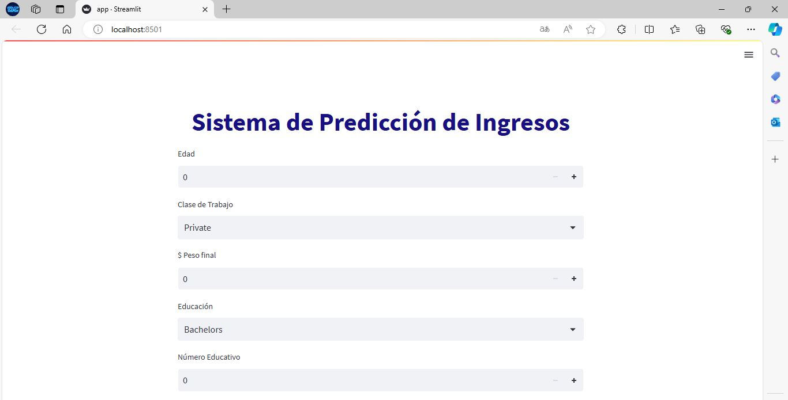

# Examen Segundo Parcial
### Integrantes:  
- Quintana Wendy
- Ramírez Erick

## Despliegue del modelo en un servidor local
Para el despliegue del modelo, todos los archivos necesarios los encuentra en la carpeta `\despligue`.
Contiene lo que es el app.py que es el script de python para levantar el servidor y cargar el modelo entrenado
> [!IMPORTANT]
> Se debe tener previamente instalado Anaconda para crear el entorno virtual con la versión de python específica

### Comandos
Con esto creamos el entorno virtual e instalamos las dependencias necesarias además de correr la aplicación con *Streamlit*
```bash
conda create -n ApiCrop
conda activate ApiCrop
conda install python=3.7
pip install gunicorn==19.9.0 Flask numpy pandas scikit-learn streamlit==0.82.0 Jinja2 protobuf
streamlit run app.py
```

### Streamlit local

